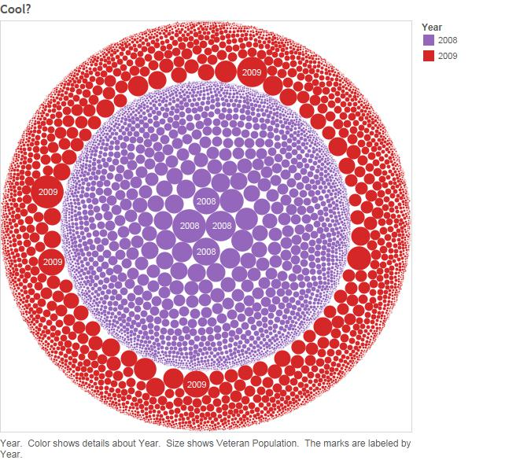
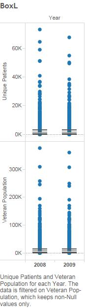
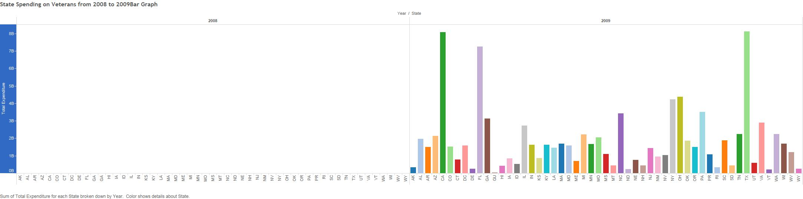
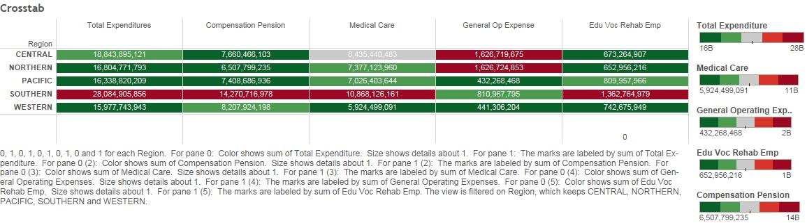
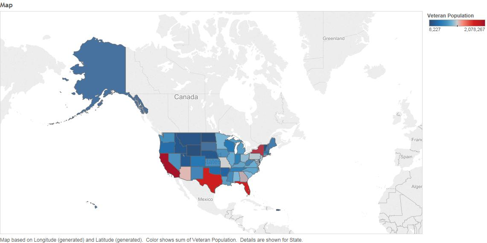

***Members***
```
Raymundo Cortez
Yuyin Wang
Chigozi Yejekwe
```

###Datasets
We found two datasets from Data.gov named Geographic Distribution of VA Expenditures for Fiscal Year 2008 and Geographic Distribution of VA Expenditures for Fiscal Year 2009. The following is a description of the datasets from the data documentation:
```
The Geographic Distribution of VA Expenditures (GDX) is an annual report that shows estimated VA expenditures for major programmatic areas by geographic area (state, county, and congressional district). The major programmatic areas are: Compensation and Pension; Readjustment (Education) and Vocational Rehabilitation; Insurance; Construction; and, Medical and Administrative. The GDX also shows the estimated veteran population for each state, county, and congressional district.
```
We thought it would be interesting to compare the results from the two years, and this would be easier if the two datasets were combined. We first uploaded the two data sets to the oracle database using modified versions of the R_ETL code. Since the two datasets share the same column names aside from one naming inconsistency and a missing column in the 2008 info for FIPS, we used the following R code to correct these inconsistencies, add a column that labels the data by which year it is from, and bind the two by their column names and then created a csv of that data.
```{r,eval=FALSE}
require(jsonlite)
require(RCurl)
require(dplyr)
df09 <- data.frame(fromJSON(getURL(URLencode('skipper.cs.utexas.edu:5001/rest/native/?query="select * from DataGov_GDX_FY9"'),httpheader=c(DB='jdbc:oracle:thin:@sayonara.microlab.cs.utexas.edu:1521:orcl', USER='C##cs329e_rc37495', PASS='orcl_rc37495', MODE='native_mode', MODEL='model', returnDimensions = 'False', returnFor = 'JSON'), verbose = TRUE), ))

df08 <- data.frame(fromJSON(getURL(URLencode('skipper.cs.utexas.edu:5001/rest/native/?query="select * from DataGov_GDX_FY08"'),httpheader=c(DB='jdbc:oracle:thin:@sayonara.microlab.cs.utexas.edu:1521:orcl', USER='C##cs329e_rc37495', PASS='orcl_rc37495', MODE='native_mode', MODEL='model', returnDimensions = 'False', returnFor = 'JSON'), verbose = TRUE), ))

df09 <- df09 %>% mutate(Year = 2009)
df08 <- df08 %>% mutate(Year = 2008)
df08 <- rename(df08,COMPENSATION_PENSION = COMPENSATION_PENSIONS)
df09$FIPS <- NULL

df09$VETERAN_POPULATION <- as.numeric(as.character(df09$VETERAN_POPULATION))
df09$UNIQUE_PATIENTS <- as.numeric(as.character(df09$UNIQUE_PATIENTS))

dfnew <- bind_rows(df09, df08)

write.csv(dfnew, file = "dfnew.csv")
```

Afterwards, we uploaded that data to the database using another modified R_ETL code.
```{r,eval=FALSE}
require(tidyr)
require(dplyr)
require(ggplot2)

setwd("~/DataVisualization/DV_FinalProject/01 Data")

file_path <- "dfnewv2.csv"

df <- read.csv(file_path, stringsAsFactors = FALSE)

# Replace "." (i.e., period) with "_" in the column names.
names(df) <- gsub("\\.+", "_", names(df))

df$X <- NULL

measures <- c("VETERAN_POPULATION", "TOTAL_EXPENDITURE", "COMPENSATION_PENSION", "CONSTRUCTION", "EDU_VOC_REHAB_EMP", "LOAN_GUARANTY" , "GENERAL_OPERATING_EXPENSES", "INSURANCE_INDEMNITIES", "MEDICAL_CARE", "UNIQUE_PATIENTS")

# Get rid of special characters in each column.
# Google ASCII Table to understand the following:
for(n in names(df)) {
  df[n] <- data.frame(lapply(df[n], gsub, pattern="[^ -~]",replacement= ""))
}

dimensions <- setdiff(names(df), measures)
if( length(measures) > 1 || ! is.na(dimensions)) {
  for(d in dimensions) {
    # Get rid of " and ' in dimensions.
    df[d] <- data.frame(lapply(df[d], gsub, pattern="[\"']",replacement= ""))
    # Change & to and in dimensions.
    df[d] <- data.frame(lapply(df[d], gsub, pattern="&",replacement= " and "))
    # Change : to ; in dimensions.
    df[d] <- data.frame(lapply(df[d], gsub, pattern=":",replacement= ";"))
  }
}

# Get rid of all characters in measures except for numbers, the - sign, and period.dimensions
if( length(measures) > 1 || ! is.na(measures)) {
  for(m in measures) {
    df[m] <- data.frame(lapply(df[m], gsub, pattern="[^--.0-9]",replacement= ""))
  }
}

write.csv(df, paste(gsub(".csv", "", file_path), ".reformatted.csv", sep=""), row.names=FALSE, na = "")

tableName <- gsub(" +", "_", gsub("[^A-z, 0-9, ]", "", gsub(".csv", "", file_path)))
sql <- paste("CREATE TABLE", tableName, "(\n-- Change table_name to the table name you want.\n")
if( length(measures) > 1 || ! is.na(dimensions)) {
  for(d in dimensions) {
    sql <- paste(sql, paste(d, "varchar2(4000),\n"))
  }
}
if( length(measures) > 1 || ! is.na(measures)) {
  for(m in measures) {
    if(m != tail(measures, n=1)) sql <- paste(sql, paste(m, "number(38,4),\n"))
    else sql <- paste(sql, paste(m, "number(38,4)\n"))
  }
}
sql <- paste(sql, ");")
cat(sql)
```




###Bar Graph

Description and Findings:

The very first thing that I noticed was that at first glance it might look like states spent nothing on Veterans in 2008. However, this would be wrong, the problem here is a matter of scale. It’s not that states did not spend on Veterans but rather, the amounts that they spent were incrementally less in 2008 than they were in 2009. While, we can’t say why, with certainty, that this was the case, we did speculate that the huge difference in numbers was due to the Recession that hit the U.S. States would have lost money and also have been strapped for funds and to make up for it in their finances, and one way, sadly, would have been to cut spending on Veterans, even despite the fact that the U.S. was still embroiled in multiple wars.



Notes for Tableau:

* First, the Dimensions of YEAR and STATE were used as Columns. This way there would be 2 bar charts.
* The Measure, TOTAL_EXPENDITURE was used as a ROW.
* Select the Side-by-Side bar graph.
* Change the graph’s color to specify each state

Notes for R:

```{r,eval=FALSE}
##Uploaded the Veterans Data frame from 2009.
df09 <- data.frame(fromJSON(getURL(URLencode('skipper.cs.utexas.edu:5001/rest/native/?query="select * from DataGov_GDX_FY9"'),httpheader=c(DB='jdbc:oracle:thin:@sayonara.microlab.cs.utexas.edu:1521:orcl', USER='C##cs329e_rc37495', PASS='orcl_rc37495', MODE='native_mode', MODEL='model', returnDimensions = 'False', returnFor = 'JSON'), verbose = TRUE), ))

##Uploaded the Veterans Data frame from 2008.
df08 <- data.frame(fromJSON(getURL(URLencode('skipper.cs.utexas.edu:5001/rest/native/?query="select * from DataGov_GDX_FY08"'),httpheader=c(DB='jdbc:oracle:thin:@sayonara.microlab.cs.utexas.edu:1521:orcl', USER='C##cs329e_rc37495', PASS='orcl_rc37495', MODE='native_mode', MODEL='model', returnDimensions = 'False', returnFor = 'JSON'), verbose = TRUE), ))

##Since we wanted to compare the two years, we needed a way to distinguish what year the data is from so we created a new column in each dataset that stated the year it originated from.
df09 <- df09 %>% mutate(Year = 2009) ##2009
df08 <- df08 %>% mutate(Year = 2008)##2008

##However, we noticed that certain columns were not consistently named so we worked around this by renaming a column in 2008 to match the name in 2009.
df08 <- rename(df08,COMPENSATION_PENSION = COMPENSATION_PENSIONS)
df09$FIPS <- NULL. 
##2009 had an extra column that 2008 did not have. From the data documentation, we knew that the column was simply for identification purposes but would serve no useful function for us so we removed it. 

##In addition, we noticed some errors such as columns that were numbers, being listed as strings so we changed those.
df09$VETERAN_POPULATION <- as.numeric(as.character(df09$VETERAN_POPULATION))
df09$UNIQUE_PATIENTS <- as.numeric(as.character(df09$UNIQUE_PATIENTS))

##Finally we binded the 2 datasets together in order to make one dataset. 
dfnew <- bind_rows(df09, df08)

##Final problem that we noticed was that in 2008, the names of states were written out as opposed to 2009 where state abbreviations were used. It turned out to be easier to just manually change the state names to abbreviations.
#Once the abbreviations were made, dfnewv2 was created and then uploaded.
dfnewv2 <- data.frame(fromJSON(getURL(URLencode('skipper.cs.utexas.edu:5001/rest/native/?query="select * from dfnewv2"'),httpheader=c(DB='jdbc:oracle:thin:@sayonara.microlab.cs.utexas.edu:1521:orcl', USER='C##cs329e_rc37495', PASS='orcl_rc37495', MODE='native_mode', MODEL='model', returnDimensions = 'False', returnFor = 'JSON'), verbose = TRUE), ))

##Selected for the categories that we wanted to use to examine the data.
dfnewv2 %>% select(YEAR, STATE, TOTAL_EXPENDITURE) 

##Viewed the data to make sure the columns were properly formed with the proper numbers.
View(dfnewv2)

##Finally the graph was made, faceted by year and a creation of a title & edit to an axis title. 
dfnewv2 %>% ggplot(aes(x = STATE, y = TOTAL_EXPENDITURE, fill = STATE)) + facet_wrap(~YEAR) + geom_bar(stat = "identity") + ggtitle("State Spending on Veterans from 2008 to 2009") + ylab("Total Expenditure")
```

The R Bar Graph can be seen here:
https://cs329e-rc37495.shinyapps.io/DV_FinalProject

###Scatterplots

Description and Findings:

While messing around in table with scatterplots, we decided to check for trends between Veteran Population and Total Expenditures. The Expenditures for 2008 are so drastically lower than those in 2009, that they appear as a straight line on the bottem of the scatter plot, so we decided to make two graphs, one for each year, and compare them. Each point is a County, and they are colored by State. The results are about what you'd expect. The higher the Veteran Population, the higher the expenditures. We noticed there were a few outliers, so we labelled by County to see what they were. It appears that DC, although having a relatively small Veteran Population (possibly due to it's relatively small size), has the second highest Expenditure in 2009 and the highest in 2008 (possibly beacuse it is the home of the Capital?). Cuyahoga, Ohio is also surprisingly high in 2009, and you can see Travis County as a slight outlier in 2009 as well.

## 2009


## 2008


Notes for Tableau:

* Drag Veteran Population to columns and Total Expenditure to rows
* Drag State to color and County to label
* Right click the graph to add a trend line, and change the options to only allow for one as opposed to one for each State, and turn off confidence intervals
* Drag Year into filters, and select the year as 2008 or 2009 to see the two graphs

Notes for R:

* Retrieve the dataset from the database
* Filter the dataframe to only contain data from 2008 or 2009
* Create a scatterplot with ggplot, use stat_smooth to create a trend line, add text geom for points above a certain range to label the interesting points (otherwise, they all overlap and aren't readable), and remove the legend

```{r,eval=FALSE}
require(jsonlite)
require(RCurl)
require(dplyr)
require(ggplot2)
dfnewv2 <- data.frame(fromJSON(getURL(URLencode('skipper.cs.utexas.edu:5001/rest/native/?query="select * from dfnewv2"'),httpheader=c(DB='jdbc:oracle:thin:@sayonara.microlab.cs.utexas.edu:1521:orcl', USER='C##cs329e_rc37495', PASS='orcl_rc37495', MODE='native_mode', MODEL='model', returnDimensions = 'False', returnFor = 'JSON'), verbose = TRUE), ))

dfnewv2$VETERAN_POPULATION=as.numeric(levels(dfnewv2$VETERAN_POPULATION))[dfnewv2$VETERAN_POPULATION]

dfnewv2 <- filter(dfnewv2, YEAR == 2008)

ggplot() + 
  coord_cartesian() + 
  scale_x_continuous() +
  scale_y_continuous() +
  layer(data=dfnewv2, 
        mapping=aes(x=VETERAN_POPULATION, y=TOTAL_EXPENDITURE, color=STATE, label=STATE), 
        stat="identity", 
        stat_params=list(), 
        geom="point",
        geom_params=list(), 
        position=position_identity()
  ) +
  stat_smooth(data=dfnewv2,
              mapping = aes(x=VETERAN_POPULATION, y=TOTAL_EXPENDITURE),
              method = "lm",
              fullrange = TRUE,
              se = FALSE
  ) +
  geom_text(data=dfnewv2,
            mapping = aes(x=VETERAN_POPULATION, y=TOTAL_EXPENDITURE,label=ifelse(TOTAL_EXPENDITURE>1500000,as.character(STATE),'')),
            hjust=0,
            just=0
  ) +
  theme(legend.position='none')
```

The R Scatterplots can both be seen here:
https://cs329e-rc37495.shinyapps.io/DV_FinalProject

###Cross-Tab:

Description and Findings:

We wanted to see the relationship, if any, between volume in spending and regions (specifically, Pacific, Central, Northern, Southern, and Western). Since the original dataset did not differentiate on a regional basis, we created a csv file with a list of state abbreviations and their respective regional designation, and joined it to our dataset. Thus we compared the 5 regions and the overall 5 heaviest expenditures against each other (Total Expenditure, Compensation Pension, Medical Care, General Operating Expenses, and Educational Vocational Rehabilitation Employment). We then applied a gradient to each expenditure, the highest spender bright red and lowest spender bright green. We found that the Southern region was the highest spender in all categories except General Operating Expenses, and the Pacific and Western region was within the lowest 40% for all five categories.



Notes for Tableau:

* Drag Region onto Rows
* Create two placeholder calculated measures [0] and [1].
* Drag 0, then 1 onto Columns, change aspects of both to Dimension
* Right click 1, and check “Dual Axis”
* Under Marks [All], delete “Measure Names” from colour
* Marks [0] is going to be used for the background colour gradient. Drag Total Expenditures onto Colour. * Expand the coloured lines by dragging measure [1] onto size. This will make a bar graph. Right click [1] size under Marks [0], and change from Measure to Dimension as well. This will make all bars 1 unit long.
* Edit colours: change palette to Red-Green Diverging, check stepped color for 5 steps, and check Reversed. 
* Marks [1] will be used for the text. Delete “Measure Names”. Drag Total Expenditures onto Label - centre align and change colour to one that is easy to see.
* Fix the x axes to be neater. Edit bottom axis to be fixed, start 0 and end 1. Erase the title, and select none for both major and minor tick marks. Edit the top axis to be fixed, both start and end at 1, title it something related to total expenditures, and with no tick marks.
* Repeat steps 3 to 9 with Compensation Pension, Medical Care, General Operating Expenses, and Educational -Vocational Rehabilitation Employment, or whatever desired


Notes for R:

* Get the primary dataset and the region legend dataset
* Merge the two datasets together
* Make a new dataset with the sum of the expenditures grouped by each region. 
* Melt into a tall dataset, with 3 columns - regions and category variables, and sum of expenditures for each region and category. 
* Filter out the territory region
* Rescale expenditures per category type
* Create a heat-plot with ggplot, with lows assigned green and highs red. Write expenditure amounts on top of each rectangle

```{r,eval=FALSE}
require("jsonlite")
require("RCurl")
require("dplyr")
require("plyr")
require("reshape2")
require("ggplot2")

# get data from oracle
df <- data.frame(fromJSON(getURL(URLencode('skipper.cs.utexas.edu:5001/rest/native/?query="select * from DFNEWV2"'),httpheader=c(DB='jdbc:oracle:thin:@sayonara.microlab.cs.utexas.edu:1521:orcl', USER='C##cs329e_rc37495', PASS='orcl_rc37495', MODE='native_mode', MODEL='model', returnDimensions = 'False', returnFor = 'JSON'), verbose = TRUE), ))
region <- data.frame(fromJSON(getURL(URLencode('skipper.cs.utexas.edu:5001/rest/native/?query="select * from REGION"'),httpheader=c(DB='jdbc:oracle:thin:@sayonara.microlab.cs.utexas.edu:1521:orcl', USER='C##cs329e_rc37495', PASS='orcl_rc37495', MODE='native_mode', MODEL='model', returnDimensions = 'False', returnFor = 'JSON'), verbose = TRUE), ))

# merge two datasets
ds <- merge(df, region, by = "STATE")

# make new dataset
expenditure <- aggregate(TOTAL_EXPENDITURE ~ REGION,data=ds,sum)
pension <- aggregate(COMPENSATION_PENSION ~ REGION,data=ds,sum)
medical <- aggregate(MEDICAL_CARE ~ REGION,data=ds,sum)
opex <- aggregate(GENERAL_OPERATING_EXPENSES ~ REGION,data=ds,sum)
rehab <- aggregate(EDU_VOC_REHAB_EMP ~ REGION,data=ds,sum)
nds <- join_all(list(expenditure, pension, medical, opex, rehab), by = "REGION", type = "full")

# melt nds
nds <- melt(nds, id.vars="REGION")

# rename variable -> EXPENSE_TYPE and value -> EXPENSE
nds <- rename(nds, c("variable"="EXPENSE_TYPE", "value"="EXPENSE"))

# filter out territory region
nds <- nds[nds$REGION != 'TERRITORY',]

# rescale in preparation for heatmap
nds <- ddply(nds, .(EXPENSE_TYPE), transform, rescale = scale(EXPENSE))

# make crosstab
crosstab <- ggplot(nds, aes(EXPENSE_TYPE, REGION)) + 
  labs(title='Expenditures by Region') +
  geom_tile(aes(fill = rescale), colour = "gray90") + 
  scale_fill_gradient(low = "green", high = "red") +
  geom_text(aes(label=EXPENSE)) +
  guides(fill=FALSE)

crosstab
```

The R Crosstab can be seen here:
https://cs329e-rc37495.shinyapps.io/DV_FinalProject

###Map

This map was created in Tableau just to observe which states had the biggest population of Veterans. California, New York, Texas and Florida seem to have the biggest Veteran Population, which isn't very surprising considering those states are also the biggest in the U.S. in general.



The map was created by selecting State, and selecting the Fill Map in the Show Me tab. Color was then dragged into the color mark, and the gradient changed to blue to red.
